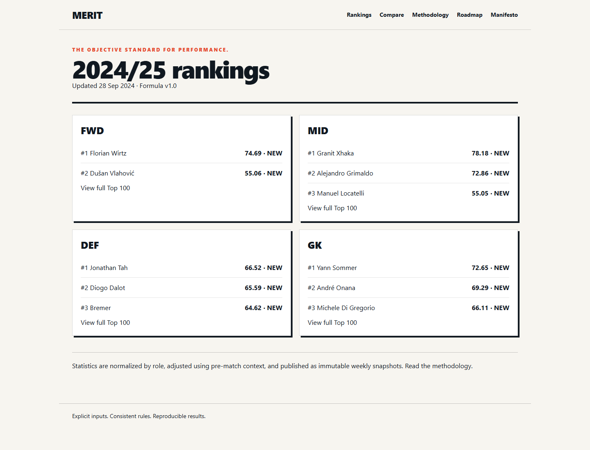

# Objective Football Player Rankings

A server-rendered Django MVP that publishes explainable weekly GK, DEF, MID, and FWD rankings from normalized fixture statistics. Scores are deterministic, formula-versioned, and precomputed; public requests never contact the football provider or calculate rankings.



## Vision

RANKED. exists to make football player rankings understandable and reproducible. It turns match statistics into weekly, position-specific rankings using explicit inputs, consistent rules, and versioned formulas—without human votes, opaque provider ratings, or AI-generated scores. The goal is not to remove judgment from football analysis, but to make every judgment in the model visible and open to scrutiny.

Read the full [project manifesto](docs/manifest.md).

## Requirements

- Python 3.12+
- PostgreSQL 16+
- Redis 7+
- Node.js (asset compilation only)

## Local setup

### Windows PowerShell

```powershell
python -m venv .venv
.venv\Scripts\Activate.ps1
pip install -e ".[dev]"
Copy-Item .env.example .env
# Create the PostgreSQL database named football_rankings, then load .env values.
python manage.py migrate
python manage.py import_scoring_formula scoring_formulas/v1.json
python manage.py seed_demo_data
python manage.py rebuild_elo --season current
python manage.py recompute_scores --season current --as-of 2026-09-30T23:59:59Z
python manage.py publish_rankings --season current --cutoff 2026-09-30T23:59:59Z
npm install
Copy-Item node_modules\htmx.org\dist\htmx.min.js static\js\htmx.min.js
npm run css:build
python manage.py runserver
```

For macOS/Linux use `source .venv/bin/activate`, `cp`, and the same Django/npm commands. The development settings fall back to SQLite and in-process cache when `DATABASE_URL`/`REDIS_URL` are unset, which makes the deterministic demo and tests easy to run. Production uses PostgreSQL and Redis.

Run verification:

```bash
pytest
ruff check .
python manage.py check_data_quality --season current
python manage.py benchmark_views --samples 50
```

## API-Football

Set `FOOTBALL_PROVIDER=api_football`, `API_FOOTBALL_KEY`, and `FORMULA_VERSION=1.0` in the server environment. Never expose the key to the browser. Provider IDs belong in database records; no league, season, team, player, or fixture IDs are guessed. Enable only the six MVP competitions in Admin after `sync_competitions`. The Free plan is quota-limited, so the incremental command records its last successful sync and skips fixtures already processed.

```bash
python manage.py sync_competitions
python manage.py sync_reference_data --season 2026-27
python manage.py sync_fixtures --season 2026-27 --from 2026-08-01 --to 2026-09-08
python manage.py sync_recent_results --since-last-success
```

For a quota-limited historical simulation, the chronological backfill reuses fixture-list metadata so each unseen fixture needs only one player-statistics request. It interleaves all tracked competitions by kickoff time, enforces the Free-plan pace and request ceiling, and can freeze one season-progress snapshot after each daily batch:

```bash
python manage.py backfill_season --season 2024-25 --from 2024-08-01 --to 2025-05-31 --daily-call-budget 100 --request-interval 6.1 --publish-snapshot
```

The initial backfill should load a prior season when the API quota permits, rebuild Elo chronologically, then ingest and score the current season. If prior history is unavailable, Elo starts at 1500 and stabilizes as cross-league fixtures accumulate.

## StatsBomb Open Data backtesting

StatsBomb Open Data is imported only into an isolated backtesting store; it never publishes rankings or mixes with API-Football operational rows. Download the official Open Data repository separately, preserve StatsBomb attribution in any published research, and run:

```bash
python manage.py import_statsbomb_open_data --path /path/to/open-data/data
```

## Operations

Run incremental result ingestion daily at 03:00 UTC, then schedule `rebuild_elo`, `recompute_scores`, and `publish_rankings` for Monday at 06:00 UTC with the same explicit cutoff. These commands use a PostgreSQL advisory lock and exit cleanly if another instance holds it. A published snapshot is immutable unless an operator deliberately invokes publication with `--force`; provider corrections otherwise appear in the next snapshot.

Production assets are built before `collectstatic`. Nginx serves static files; Gunicorn serves Django. Copy the examples in `deployment/` and replace placeholders without committing secrets.
